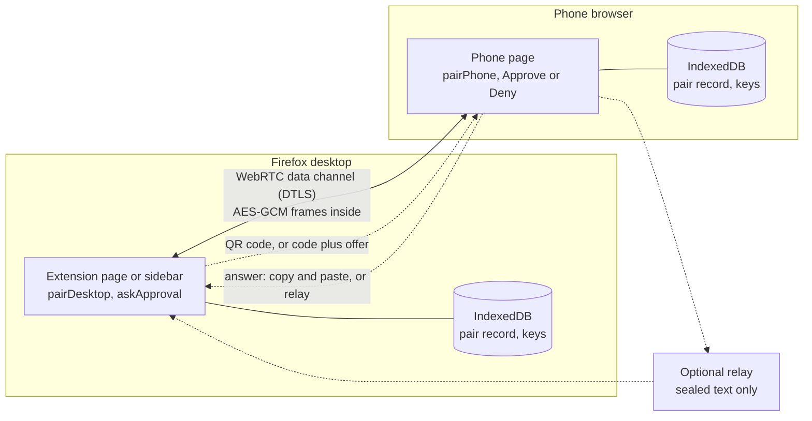
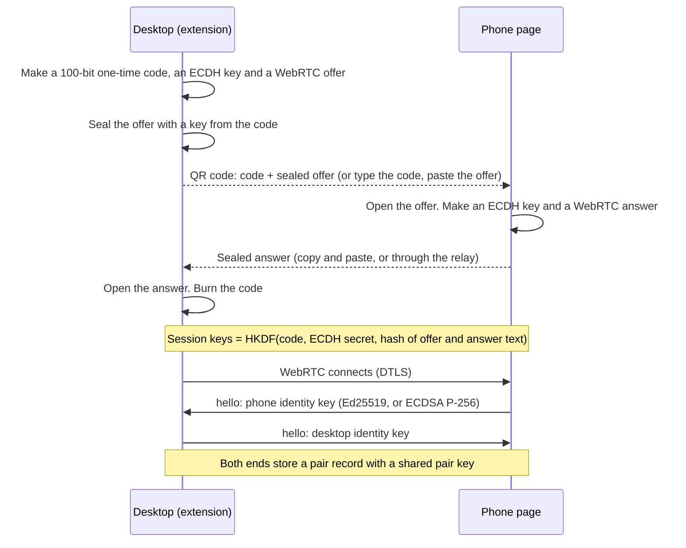
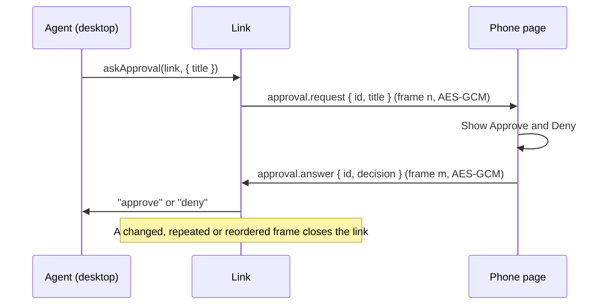
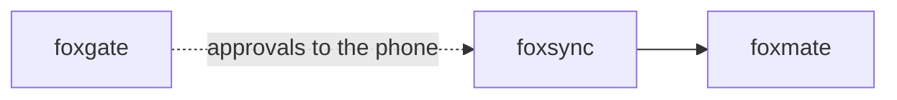

# foxsync

Control your Firefox agent from your phone over an encrypted peer-to-peer link.

foxsync pairs a Firefox extension with a phone, or with any second browser. The two ends talk over a WebRTC data channel. Every message is encrypted and authenticated a second time, on top of DTLS, with keys from the pairing. Version 0.1 needs no server.

## Install

```bash
npm i foxsync
```

foxsync runs in a browser page: an extension page, a sidebar, or a normal web page. It uses WebRTC, Web Crypto and IndexedDB.

## Example

On the desktop, in an extension page or a sidebar:

```js
import { askApproval, pairDesktop } from "foxsync";

const pairing = await pairDesktop({ name: "My laptop" });
console.log(pairing.qr); // put this text in a QR code, or show pairing.code and pairing.offer
const link = await pairing.waitForPhone(prompt("Paste the answer from the phone"));

const decision = await askApproval(link, { title: "Send the email to Sam?" });
console.log(decision); // "approve" or "deny"
```

On the phone, in any page that bundles foxsync:

```js
import { onApprovalRequest, pairPhone } from "foxsync";

const pairing = await pairPhone(prompt("Paste the QR text"));
console.log(pairing.answer); // give this text to the desktop
const link = await pairing.waitForDesktop();
onApprovalRequest(link, (request) => (confirm(request.title) ? "approve" : "deny"));
```

You do not have to write the phone side. The [phone page](#phone-page) in `phone/` does it.

## Use cases

| Who | What they build | How foxsync helps |
|---|---|---|
| A user of a browser agent such as foxmate | Approve or deny agent actions from the phone | The agent calls `askApproval`. The phone page shows Approve and Deny. The answer comes back authenticated. |
| A developer of a long agent task | Notifications from a task that runs for an hour | The extension sends `note` messages. The phone page shows them in a feed. |
| A person who keeps Firefox running at home | Remote control of the home Firefox from the phone | The phone sends commands over the link. Across networks this needs the relay and a TURN server (see [Limits](#limits)). |
| A presenter | A second screen: next slide, previous slide, timer | The phone sends `next` and `previous` messages. The extension moves the slides in the presentation tab. |
| A family member or a caregiver | Help for a parent who uses an agent | The helper pairs a phone with the parent's Firefox and answers approval requests for risky actions. |
| A QA engineer | A test run that waits for a person to confirm a step | The test asks on the phone and goes on when the person approves. |

## How it works



Pairing has two steps and needs no server:



An approval round trip:



Details:

- **The code.** It has 20 characters from a 32-character set, so 100 random bits. It is valid for 10 minutes and works once. After 3 wrong answers, the pairing stops.
- **Sealed text.** The offer and the answer are compressed, then sealed with AES-GCM. Their kind and pairing id are authenticated. The offer is safe to send over any channel, because it is useless without the code. Keep the QR code private: it holds the code.
- **Keys.** Session keys come from the code (or, later, the pair key), a new ECDH P-256 secret, and a hash of the exact offer and answer text. That text holds the DTLS fingerprints. So a swapped SDP gives other keys, and the first frame fails.
- **Frames.** Each message is a frame: version, sequence number, AES-256-GCM ciphertext. Each direction has its own key. The channel is ordered and reliable, so the receiver closes the link on a bad tag (`bad-mac`), an old sequence number (`replay`) or a skipped one (`reorder`).
- **Heartbeats.** Each end sends a heartbeat after 5 seconds without traffic. After 15 seconds without a frame, the link closes with `timeout`. This finds a phone that lost its network.
- **Identity keys.** After the channel opens, each end makes a key pair for this pair only. It uses Ed25519 when the phone has it, else ECDSA P-256. The private keys are not extractable.
- **Reconnect.** Either end can start. The reconnect offer and answer are sealed with the pair key and signed with the identity key. Each end saves the newest time it accepted, so a replayed offer fails.

Every failure mode and its test is in [docs/failure-modes.md](docs/failure-modes.md).

## API

foxsync is a library. It has no CLI and no MCP server.

| Export | What it does |
|---|---|
| `pairDesktop(options?)` | Starts pairing. Returns `{ id, code, offer, qr, expiresAt, waitForPhone(answer?), cancel() }`. `qr` is `null` when the text is longer than `qrMax` (default 1800). |
| `pairPhone(qrText \| { code, offer }, options?)` | Answers a pairing. Returns `{ id, answer, relayed, waitForDesktop(), cancel() }`. |
| `reconnect(pairId, options?)` | Starts a new session with a paired device. Returns `{ id, offer, relayed, waitForAnswer(answer?), cancel() }`. |
| `acceptReconnect(offerText \| { pairId }, options?)` | Answers a reconnect offer. With `{ pairId }`, it takes the offer from the relay. Returns `{ id, answer, relayed, waitForLink(), cancel() }`. |
| `link.send(type, payload)` | Encrypts and sends one message. Types that start with `fsy:` are reserved. The limit is 64 KiB. |
| `link.on(type, fn)` | Calls `fn(payload)` for each message of this type. Returns a function that removes it. |
| `link.close()` | Closes the link. `link.closed` resolves with `null`, or with the `FoxsyncError` that closed it. |
| `listPairs(options?)` | Lists paired devices: `{ id, role, name, peerName, alg, createdAt }`. No key material. |
| `unpair(id, options?)` | Deletes a pair record and its keys. Returns `false` for an unknown id. |
| `askApproval(link, { title, detail? }, { timeoutMs? })` | Asks the other end. Resolves with `"approve"` or `"deny"`. |
| `onApprovalRequest(link, handler)` | Answers requests. The handler returns the decision, or a promise of it. |
| `browserWire(rtcConfig?)` | The WebRTC connection that pairing uses by default. Give ICE servers here to add STUN or TURN. |
| `MemoryStore`, `IdbStore` | Pair stores. The default is `IdbStore` (IndexedDB database `foxsync`). |
| `FoxsyncError` | Every error. Read `error.code`, for example `bad-mac`, `replay`, `timeout`, `used`, `expired`, `unknown-pair`. |

Options for the pairing and reconnect functions:

| Option | Default | What it does |
|---|---|---|
| `name` | `"Desktop"` or `"Phone"` | The name that the other end shows. |
| `store` | `IdbStore` | Where pair records go. |
| `wire` | `browserWire()` | How to make the peer connection. |
| `phoneUrl` | none | `pairDesktop` only. The QR text becomes `<phoneUrl>#<pairing text>`, so a phone camera app opens the phone page. |
| `relay` | none | The relay URL. `pairDesktop` puts it in the sealed offer, and both ends store it for reconnects. |
| `ttlMs` | 600000 | `pairDesktop` only. How long the code works. |
| `handshakeMs` | 30000 | How long to wait for the channel and the hello messages. |
| `link` | `{}` | `heartbeatMs` (5000), `timeoutMs` (15000), `maxBytes` (65536). |

### Phone page

`phone/` is a static page for phones. Build it with `pnpm build:phone`. The output in `dist-phone/` is one HTML file, one CSS file and one classic script. It runs on a static host, and from `file://` for tests.

Host the page on an origin of its own, for example `phone.example.org`. The pair records and keys are in the IndexedDB of that origin. Every other page on the same origin can read the records and use the keys. A project page on a shared origin, such as `<user>.github.io/<repo>`, is not safe.

The page pairs from the QR text, or from the code plus the offer. When the page URL has the pairing text in its fragment, the page shows the code and waits. It pairs only after you press Pair. Make sure that the code is the one on your desktop, because anyone can send you such a link. The fragment never goes to the web server. Then the page shows `note` messages (`{ text }`) and approval requests with Approve and Deny. It also answers reconnect offers and lists paired devices.

### Demo extension

`extension/` is a demo. Build it with `pnpm build:ext` and load `dist-ext/` as a temporary add-on. Install from AMO: [addons.mozilla.org/firefox/addon/foxsync](https://addons.mozilla.org/firefox/addon/foxsync/) (pending AMO review; the link works after approval). It opens as the toolbar popup or in the sidebar. Use the sidebar: a popup closes when it loses focus, and the link closes with it. The page can:

- pair a phone: QR code, code, offer, and a box for the answer,
- list paired devices, with Reconnect and Unpair,
- send a sample approval request and show the phone's answer.

### Relay

`relay/` is an optional Cloudflare Worker. This repo does not deploy it. To run your own, run `npx wrangler deploy` in `relay/`. It keeps one text per box and slot for 10 minutes. It takes only foxsync text up to 16 KiB.

With a relay, the phone posts its pairing answer, and the desktop picks it up. Nobody copies the answer back. Reconnects can go through it too.

What the relay can see:

- the box ids, which stay the same for one pair across reconnects,
- the IP addresses of both ends, the times, and the size of each text.

What the relay cannot do:

- read the SDP (with your IP candidates), the keys, or any message, because each text is sealed,
- make an offer or an answer that an end accepts, because it does not know the code or the pair key,
- change a message on the link, because messages do not go through it.

The relay can drop or delay texts. It can also fill a box with junk, which costs a pairing attempt each time.

## Firefox APIs used

| API | Why |
|---|---|
| [`RTCPeerConnection`](https://developer.mozilla.org/en-US/docs/Web/API/RTCPeerConnection) | The peer-to-peer connection. No ICE servers by default. |
| [`RTCDataChannel`](https://developer.mozilla.org/en-US/docs/Web/API/RTCDataChannel) | One ordered, reliable channel for the encrypted frames. |
| [`SubtleCrypto.sign`](https://developer.mozilla.org/en-US/docs/Web/API/SubtleCrypto/sign) / [`verify`](https://developer.mozilla.org/en-US/docs/Web/API/SubtleCrypto/verify) (Ed25519, ECDSA P-256) | Identity signatures on reconnect text. Ed25519 is in Firefox 129 and later. |
| [`SubtleCrypto.generateKey`](https://developer.mozilla.org/en-US/docs/Web/API/SubtleCrypto/generateKey) | Non-extractable identity keys and one-use ECDH keys. |
| [`SubtleCrypto.deriveBits`](https://developer.mozilla.org/en-US/docs/Web/API/SubtleCrypto/deriveBits) / [`deriveKey`](https://developer.mozilla.org/en-US/docs/Web/API/SubtleCrypto/deriveKey) (ECDH, HKDF) | Session keys, the pair key and relay box ids. |
| [`SubtleCrypto.encrypt`](https://developer.mozilla.org/en-US/docs/Web/API/SubtleCrypto/encrypt) / [`decrypt`](https://developer.mozilla.org/en-US/docs/Web/API/SubtleCrypto/decrypt) (AES-GCM) | Sealed text and the encrypted frames. |
| [`SubtleCrypto.digest`](https://developer.mozilla.org/en-US/docs/Web/API/SubtleCrypto/digest) (SHA-256) | The hash of the offer and answer text. |
| [`Crypto.getRandomValues`](https://developer.mozilla.org/en-US/docs/Web/API/Crypto/getRandomValues) | The code, ids and nonces. |
| [`CompressionStream`](https://developer.mozilla.org/en-US/docs/Web/API/CompressionStream) / [`DecompressionStream`](https://developer.mozilla.org/en-US/docs/Web/API/DecompressionStream) | Shorter offer text, so it fits in a QR code. |
| [IndexedDB](https://developer.mozilla.org/en-US/docs/Web/API/IndexedDB_API) | Pair records. It stores `CryptoKey` objects without their bytes. |
| [`fetch`](https://developer.mozilla.org/en-US/docs/Web/API/Window/fetch) | The optional relay. |
| [`sidebar_action`](https://developer.mozilla.org/en-US/docs/Mozilla/Add-ons/WebExtensions/manifest.json/sidebar_action) | Demo: the sidebar keeps the link open. |
| [`action`](https://developer.mozilla.org/en-US/docs/Mozilla/Add-ons/WebExtensions/manifest.json/action) | Demo: the toolbar popup. |
| [Canvas API](https://developer.mozilla.org/en-US/docs/Web/API/Canvas_API) | Demo: draws the QR code (with [uqr](https://github.com/unjs/uqr)). |
| [`Clipboard.writeText`](https://developer.mozilla.org/en-US/docs/Web/API/Clipboard/writeText) | Phone page: the Copy button for the answer. |

The library uses no WebExtension API, so it also runs in a normal page. The link must live in a page that stays open. The MV3 background is an event page, and it unloads when idle. That drops the link, so use the sidebar or a pinned tab.

## Limits

- **No server means the same network, or manual text.** With no ICE servers, WebRTC uses host candidates only. Both ends must reach each other directly, for example on one Wi-Fi network.
- **No STUN or TURN.** foxsync does not provide them. Across networks, give STUN servers to `browserWire`. Through a strict NAT, you need a TURN server.
- **The link lives in one page.** When the page closes, the link closes. Call `reconnect` to start a new one.
- **The phone page has no camera scanner.** A phone camera app opens the QR code only when `phoneUrl` points to a hosted phone page. Without it, paste the QR text. The desktop cannot scan a QR code from the phone either.
- **The phone page is not hosted yet.** Put `dist-phone/` on a static host with its own origin.
- **The demo reconnects by copy and paste only.** Reconnect through the relay works in the API, but the demo pages have no button for it.
- **Tested in Firefox only.** The E2E runs two Firefox 157 instances on one Mac, with the phone page at a phone-sized viewport. Safari, Chrome and real phones are not tested.
- **Reconnects from two pages at once.** Each page keeps the updates of a pair record in order. Two pages of one origin that reconnect the same pair at the same moment do not.
- **One link per pair at a time.** There is no fan-out to many phones in one call.
- **The relay has no rate limit.** Add a Cloudflare rate limiting rule if you run one in public.

## Testing

`pnpm ci:local` runs lint, typecheck, the unit tests, the builds and `web-ext lint`. `pnpm e2e` starts two real Firefox instances. They pair by copy and paste, run an approval round trip, reject a tampered frame, drop and reconnect the link, refuse a reconnect after unpair, and pair through a local relay. The result goes to `artifacts/e2e-<date>.json`.

## Part of the fox primitives



foxsync depends on no other fox repo. [foxmate](https://github.com/pooriaarab/foxmate) will use it to send [foxgate](https://github.com/pooriaarab/foxgate) approvals to the phone.

## License

MIT
